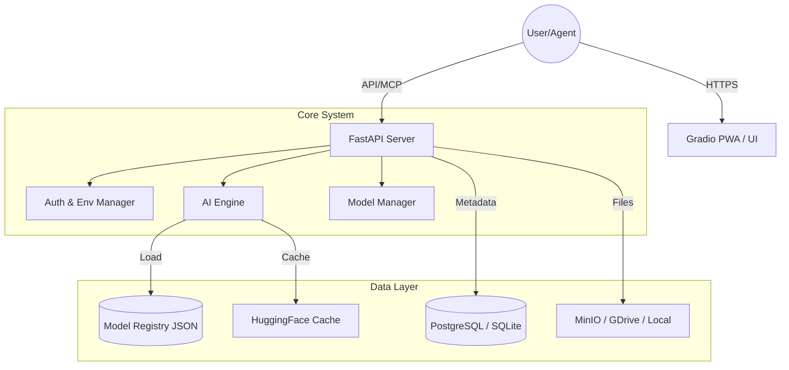

นี่คือไฟล์ **`README.md`** ฉบับสมบูรณ์ที่เขียนขึ้นอย่างมืออาชีพ (Professional Grade) โดยครอบคลุมรายละเอียดทางเทคนิค วิธีการติดตั้ง และคู่มือการใช้งาน เหมาะสำหรับนำไปวางหน้าแรกของ GitHub Repository ครับ

---

# 🛠️ DST Platform (Data Scientist Tools)

**DST Platform** คือระบบ **Hybrid AI Operations Station** แบบ All-in-One ที่ออกแบบมาเพื่อ Data Scientist และ ML Engineer โดยเฉพาะ ช่วยลดรอยต่อระหว่างการพัฒนาบนเครื่อง Local และการรันบน Cloud (Google Colab/Docker)

โปรเจกต์นี้รวมความสามารถของ **FastAPI**, **Gradio**, **Hugging Face**, และ **PostgreSQL** เข้าไว้ด้วยกัน พร้อมระบบจัดการโมเดลแบบ **Tag-Based** ที่ยืดหยุ่นที่สุด

---

## ✨ ฟีเจอร์เด่น (Key Features)

* **🧠 Intelligent Resource Management:** ตรวจจับ Hardware (CPU/GPU/VRAM) อัตโนมัติ และเลือกโหลดโมเดลด้วย Precision ที่เหมาะสม (`float16`/`float32`)
* **🏷️ Tag-Based Model Manager:** ระบบจัดการโมเดลอัจฉริยะ ไม่ต้องแยกโฟลเดอร์ สามารถดาวน์โหลดจาก Hugging Face และติด Tag (เช่น `audio`, `text`) เพื่อจัดหมวดหมู่ได้เอง
* **🔌 Hybrid Environment:** โค้ดชุดเดียว รันได้ทุกที่:
* **Local:** เก็บข้อมูลลง Disk หรือ MinIO
* **Colab:** Mount Google Drive อัตโนมัติ เพื่อเก็บ Model Cache และ Data ไม่ให้หายเมื่อ Session ตัด


* **📱 Progressive Web App (PWA):** รองรับการติดตั้งเป็นแอปพลิเคชันบน iPad, Android Tablet หรือ Desktop เพื่อใช้งานแบบ Full-screen
* **💾 Multi-Storage Backend:** รองรับการเก็บไฟล์เสียงและข้อมูลผ่าน Local Disk, Google Drive API, และ MinIO (S3 Compatible)
* **🤖 AI-Assisted Labeling:** ใช้ AI (เช่น Whisper) ช่วย Pre-label ข้อมูลเสียง เพื่อลดเวลาการทำงานของมนุษย์

---

## 🏗️ สถาปัตยกรรมระบบ (Architecture)



---

## 🚀 การติดตั้ง (Installation)

แนะนำให้ใช้ **[`uv`](https://www.google.com/search?q=%5Bhttps://github.com/astral-sh/uv%5D(https://github.com/astral-sh/uv))** เพื่อความรวดเร็วในการติดตั้ง (เร็วกว่า pip 10-100 เท่า)

### 1. Clone & Setup Environment

```bash
git clone https://github.com/yourusername/dst-platform.git
cd dst-platform

# สร้าง Environment และติดตั้ง Library ทั้งหมดอัตโนมัติ
uv sync

```

### 2. ตั้งค่า Configuration

สร้างไฟล์ `.env` ที่ root folder:

```env
# .env
HF_TOKEN=your_huggingface_token_here
DB_PASSWORD=secret
MINIO_ACCESS_KEY=admin
MINIO_SECRET_KEY=password

```

ตรวจสอบไฟล์ `config/settings.yaml` เพื่อปรับแต่ง Path หรือ Database:

```yaml
system:
  env: "auto" # auto detect colab/local

models:
  base_path: "./models" # แก้เป็น path ที่ต้องการเก็บโมเดล

```

### 3. เตรียม Static Files (สำหรับ PWA)

* นำไฟล์ไอคอน `.png` มาวางในโฟลเดอร์ `static/`
* ตั้งชื่อเป็น `icon-192.png` และ `icon-512.png`

---

## ⚡ วิธีการใช้งาน (Usage)

### รันในโหมด Developer (Hot Reload)

เหมาะสำหรับการแก้โค้ด เซิร์ฟเวอร์จะรีสตาร์ทเองเมื่อเซฟไฟล์

```bash
uv run uvicorn main:app --reload --port 8000

```

### รันบน Google Colab

Copy โค้ดทั้งหมด หรือ Clone Repo ไปวาง แล้วรันคำสั่ง:

```python
!pip install uv
!uv sync
!uv run python main.py
# ระบบจะแสดงลิงก์ ngrok ให้เข้าใช้งาน

```

---

## 📖 คู่มือการใช้งานฟีเจอร์หลัก

### 1. 🧠 Model Manager (การจัดการโมเดล)

* ไปที่แท็บ **Model Manager**
* ใส่ชื่อ **Hugging Face Model ID** (เช่น `openai/whisper-large-v3`)
* เลือก **Tags** ที่ต้องการ (เช่น `audio`, `asr`)
* กด **Download & Register**
* *ผลลัพธ์:* โมเดลจะถูกโหลดเก็บไว้ในเครื่อง ไม่ต้องโหลดใหม่ซ้ำๆ และพร้อมเรียกใช้ทันที

### 2. 🎙️ Audio Lab (การถอดความเสียง)

* ไปที่แท็บ **Audio Lab**
* เลือกโมเดลจาก Dropdown (ระบบจะกรองเฉพาะโมเดลที่มี Tag `audio` มาให้)
* อัปโหลดไฟล์เสียง หรือเลือกจาก Storage
* กด **Transcribe**
* *ผลลัพธ์:* AI จะถอดความออกมา คุณสามารถแก้ไขและกด Save ลง Database ได้

---

## 📂 โครงสร้างไฟล์ (Project Structure)

```text
dst-platform/
├── main.py                  # Entry Point หลัก
├── config/                  # การตั้งค่าระบบ (YAML)
├── static/                  # PWA Manifest & Icons
├── src/
│   ├── core/                # System Logic (DB, Storage, Hardware)
│   ├── backend/             # Business Logic (AI, Model Registry)
│   └── ui/                  # Gradio Components
└── models/                  # (Auto-generated) ที่เก็บไฟล์โมเดล
    ├── registry.json        # ฐานข้อมูล Tags ของโมเดล
    └── storage/             # ไฟล์โมเดลจริงๆ

```

---

## 🛠️ Tech Stack

* **Language:** Python 3.10+
* **Web Framework:** FastAPI
* **Interface:** Gradio 5.0
* **AI/ML:** Hugging Face Transformers, PyTorch, Accelerate
* **Database:** SQLModel (SQLite/PostgreSQL)
* **Package Manager:** uv

---

## 🤝 Contributing

Contributions are welcome! Please feel free to submit a Pull Request.

1. Fork the Project
2. Create your Feature Branch (`git checkout -b feature/AmazingFeature`)
3. Commit your Changes (`git commit -m 'Add some AmazingFeature'`)
4. Push to the Branch (`git push origin feature/AmazingFeature`)
5. Open a Pull Request

---

## 📄 License

Distributed under the MIT License. See `LICENSE` for more information.

---

### Developed with ❤️ by Satang The Value

*Professional Data Tools for the Modern Era.*